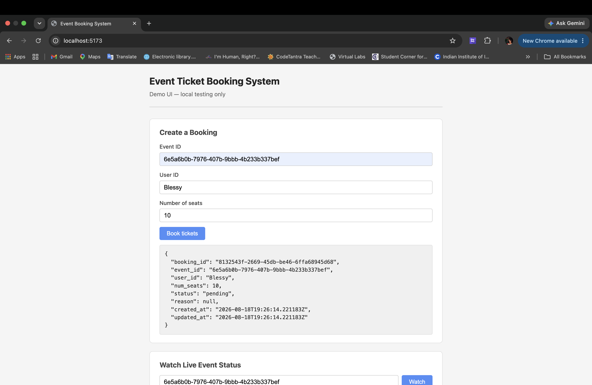
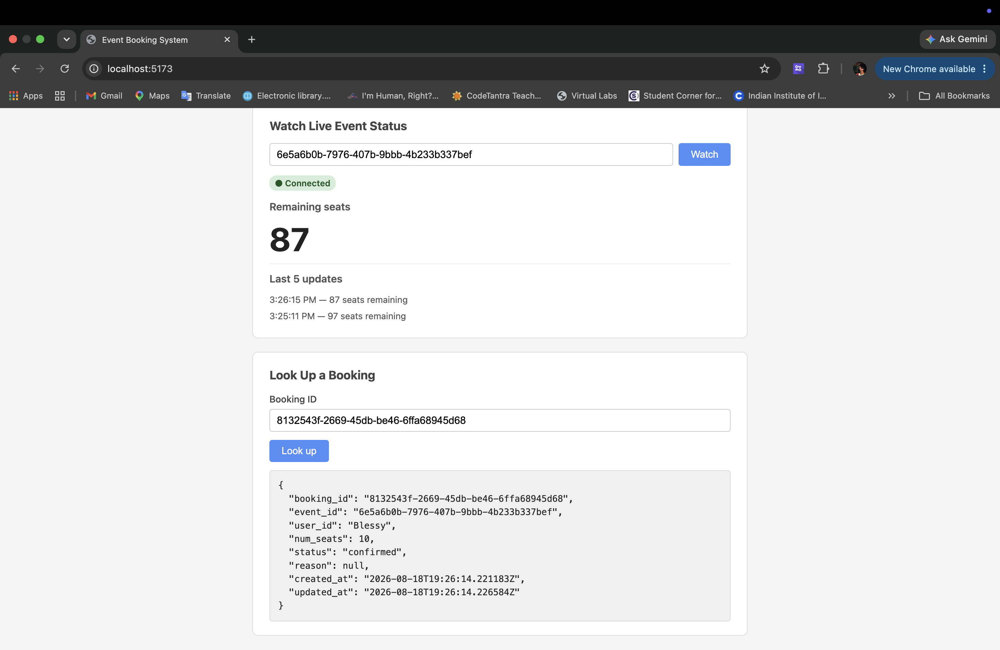
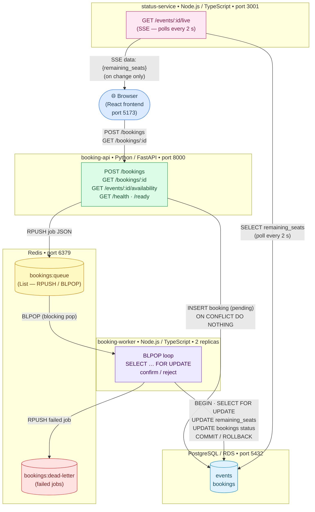
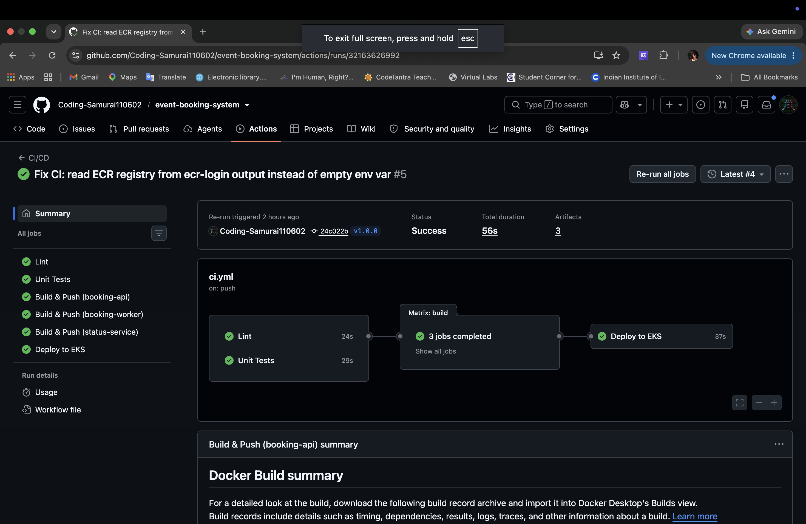

# Event Ticket Booking System

A distributed event booking system with concurrency-safe inventory handling — built to process concurrent booking requests without overselling seats, while keeping the API responsive under load.

React frontend, FastAPI backend, a Redis-backed job queue, a worker using row-level locking (`SELECT ... FOR UPDATE`) for inventory checks, and live seat-availability updates via Server-Sent Events. Deployed to AWS EKS with RDS Postgres, infrastructure provisioned through Terraform, with a CI/CD pipeline via GitHub Actions.

## Demo





---

## Architecture



### Services

| Service | Language | Role |
|---|---|---|
| `booking-api` | Python / FastAPI | Accepts booking requests, validates payload, persists a `pending` row, pushes a job to Redis. Returns immediately — no synchronous inventory check. |
| `booking-worker` | Node.js / TypeScript | Polls Redis with `BLPOP`. For each job, runs a single Postgres transaction with `SELECT … FOR UPDATE` to check and decrement seat inventory atomically. Confirms or rejects the booking. |
| `status-service` | Node.js / TypeScript / Express | Exposes a Server-Sent Events stream (`GET /events/:id/live`) that polls Postgres every 2 s and pushes seat-count diffs to connected clients. |

### Why the worker cannot overbook

Two workers processing bookings for the same event simultaneously is the primary race condition in any distributed ticketing system. The fix is in `booking-worker/src/worker.ts`:

```sql
BEGIN;
SELECT remaining_seats FROM events WHERE id = $1 FOR UPDATE;
-- ↑ acquires a row-level lock; the second worker blocks here until this transaction commits
UPDATE events SET remaining_seats = remaining_seats - $1 WHERE id = $2;
UPDATE bookings SET status = 'confirmed' ...;
COMMIT;
```

`FOR UPDATE` serialises concurrent writes to the same event row at the database level. No application-level mutex or Redis lock is needed.

### Why the worker never crash-loops on startup

A common production failure mode: a worker container starts before its dependencies are ready, fails to connect, and enters a crash-loop that Kubernetes keeps restarting. The fix is in `booking-worker/src/backoff.ts` — `withExponentialBackoff` retries the connection indefinitely with delays of 1 s → 2 s → 4 s → … capped at 30 s, logging every attempt. The worker only enters the main processing loop after both Redis and Postgres are reachable.

### What happens to a job that throws an unexpected error

If `processJob` throws anything other than an inventory-rejection (a genuine exception — DB disconnect, malformed payload, etc.), the raw job payload is pushed to `bookings:dead-letter` in Redis instead of being silently dropped. No booking is ever lost; dead-lettered jobs can be inspected and replayed.

---

## Architecture Diagram

> Rendered automatically by GitHub. For the standalone source see [`docs/architecture.mmd`](docs/architecture.mmd).


---

## Running locally with Docker Compose

```bash
# 1. Copy the example env file (already gitignored)
cp .env.example .env

# 2. Start everything: Postgres + Redis + all 3 services
docker compose up --build

# 3. Seed a test event
docker compose exec postgres psql -U bookings -d bookings -c \
  "INSERT INTO events (name, total_seats, remaining_seats) \
   VALUES ('Test Concert', 100, 100) RETURNING id;"

# 4. Create a booking (use the event_id from step 3)
curl -X POST http://localhost:8000/bookings \
  -H 'Content-Type: application/json' \
  -d '{"event_id":"<id>","user_id":"u-1","num_seats":2}'

# 5. Poll status
curl http://localhost:8000/bookings/<booking_id>

# 6. Watch live seat count via SSE
curl -N http://localhost:3001/events/<event_id>/live

# 7. Wipe and restart (re-runs migrations)
docker compose down -v && docker compose up --build
```

---

## Running on Minikube

```bash
# 1. Start Minikube
minikube start

# 2. Build images inside Minikube's Docker daemon
eval $(minikube docker-env)
docker build -t booking-api:local    ./booking-api
docker build -t booking-worker:local ./booking-worker
docker build -t status-service:local ./status-service

# 3. Create the secret (gitignored — fill from the committed example)
cp k8s/secret.example.yaml k8s/secret.yaml
kubectl apply -f k8s/secret.yaml

# 4. Apply infra layer first (in-cluster Postgres + Redis)
kubectl apply -f k8s/configmap.yaml
kubectl apply -f k8s/local/postgres-configmap.yaml
kubectl apply -f k8s/local/postgres.yaml
kubectl apply -f k8s/local/redis.yaml
kubectl rollout status statefulset/postgres
kubectl wait --for=condition=ready pod -l app=redis --timeout=60s

# 5. Apply application layer
kubectl apply -f k8s/booking-api/
kubectl apply -f k8s/booking-worker/
kubectl apply -f k8s/status-service/

# 6. Expose services locally
kubectl port-forward svc/booking-api    8000:80 &
kubectl port-forward svc/status-service 3001:80 &
```

> **Note:** `k8s/local/` manifests (Postgres StatefulSet, Redis Deployment, PVCs) are for
> Minikube only. In production those are replaced by RDS and ElastiCache — only the
> `DATABASE_URL` and `REDIS_URL` values in `k8s/secret.yaml` change.

---

## Deploying to AWS (EKS + RDS)

### 1. Provision infrastructure

```bash
cd terraform
cp terraform.tfvars.example terraform.tfvars   # create this file
# Minimum contents:
#   rds_password           = "a-strong-password"
#   eks_node_instance_type = "t3.medium"
#   eks_node_desired_size  = 1
#   eks_node_min_size      = 1

terraform init
terraform plan
terraform apply

# Configure kubectl
$(terraform output -raw kubeconfig_command)
```

### 2. Install metrics-server (required for HPA)

```bash
kubectl apply -f https://github.com/kubernetes-sigs/metrics-server/releases/latest/download/components.yaml
kubectl get hpa booking-worker   # wait until TARGETS shows a % not <unknown>
```

### 3. Apply manifests

```bash
# Fill in k8s/secret.yaml with RDS endpoint + credentials (gitignored)
kubectl apply -f k8s/secret.yaml
kubectl apply -f k8s/configmap.yaml
kubectl apply -f k8s/storageclass.yaml
kubectl apply -f k8s/booking-api/
kubectl apply -f k8s/booking-worker/
kubectl apply -f k8s/status-service/
```

### 4. Enable SSL for RDS

```bash
kubectl patch configmap booking-config --patch '{"data":{"DB_SSL":"true"}}'
kubectl rollout restart deployment/booking-api deployment/booking-worker deployment/status-service
```

---

## CI/CD Pipeline



The pipeline is defined in `.github/workflows/ci.yml`.

### What triggers it

| Event | Jobs that run |
|---|---|
| Push to any branch | `lint` → `test` → `build` (no deploy) |
| Pull request against `main` | `lint` → `test` → `build` (no deploy) |
| Tag push matching `v*.*.*` | `lint` → `test` → `build` → `deploy` (with manual approval gate) |

### What each job does

**`lint`** — runs in parallel with `test`

- `ruff check` on `booking-api/app` and `booking-api/tests`
- `tsc --noEmit` type-check on `booking-worker` and `status-service`

**`test`** — runs in parallel with `lint`

- `pytest booking-api/tests/` — idempotency tests (3 tests, no live dependencies; DB and Redis are mocked)
- `jest --ci` on `booking-worker/tests/` — inventory row-locking logic (5 tests) and exponential-backoff correctness (4 tests)

**`build`** (runs after both `lint` and `test` pass)

- Matrix strategy: `booking-api`, `booking-worker`, `status-service` build in parallel
- Multi-stage Dockerfile per service, targeting `linux/amd64`
- Pushed to ECR with two tags: `<ECR_REGISTRY>/<service>:<git-sha>` on every run, plus `<ECR_REGISTRY>/<service>:<semver-tag>` on tag pushes
- Layer cache stored in GitHub Actions cache (per-service scope) to speed up subsequent builds

**`deploy`** (runs after `build`, only on `v*.*.*` tag pushes)

- Pauses for human approval in the `production` GitHub Environment before any `kubectl` command runs
- Authenticates to AWS and updates kubeconfig for the EKS cluster
- Uses `kubectl set image` with the exact Git SHA tag — not `kubectl apply -f` on the whole directory — so only the image reference changes; no risk of accidentally applying a locally-modified manifest
- Re-applies `configmap.yaml`, `storageclass.yaml`, and all Service/HPA manifests (idempotent)
- Waits for all three rollouts to complete (`--timeout=300s`)
- Runs a final smoke test: asserts `readyReplicas == replicas` for every Deployment

### Required GitHub Secrets

Configure these in **Settings → Secrets and variables → Actions → New repository secret**:

| Secret | Value |
|---|---|
| `AWS_ACCESS_KEY_ID` | Access key ID for an IAM user with ECR push and EKS access |
| `AWS_SECRET_ACCESS_KEY` | Corresponding secret access key |
| `ECR_REGISTRY` | Your ECR registry hostname, e.g. `123456789012.dkr.ecr.us-east-1.amazonaws.com` |
| `EKS_CLUSTER_NAME` | The EKS cluster name — matches `var.eks_cluster_name` in Terraform (`event-booking-eks` by default) |

#### Minimum IAM permissions for the CI user

```json
{
  "Version": "2012-10-17",
  "Statement": [
    {
      "Effect": "Allow",
      "Action": [
        "ecr:GetAuthorizationToken",
        "ecr:BatchCheckLayerAvailability",
        "ecr:InitiateLayerUpload",
        "ecr:UploadLayerPart",
        "ecr:CompleteLayerUpload",
        "ecr:PutImage"
      ],
      "Resource": "*"
    },
    {
      "Effect": "Allow",
      "Action": ["eks:DescribeCluster"],
      "Resource": "arn:aws:eks:*:*:cluster/event-booking-eks"
    }
  ]
}
```

#### Setting up the manual approval gate

1. Go to **Settings → Environments → New environment**, name it `production`
2. Enable **Required reviewers** and add yourself (or your team)
3. The `deploy` job will pause after `build` completes and post a notification; click **Review deployments → Approve** to proceed

### Deploying a new version

```bash
git tag v1.2.3
git push origin v1.2.3
# Pipeline runs lint → test → build → (approval prompt) → deploy
```

---

## Frontend

A minimal React demo UI built with Vite. It is a functional testing interface — not a production application.

### What it does

| Section | Component | Backed by |
|---|---|---|
| Create a Booking | `BookingForm` | `POST /bookings` on booking-api |
| Watch Live Event Status | `LiveEventStatus` | `GET /events/:id/live` SSE on status-service |
| Look Up a Booking | `BookingLookup` | `GET /bookings/:id` on booking-api |

### Running with Docker Compose (all 4 services)

```bash
docker compose up --build
# Frontend available at http://localhost:5173
# booking-api at http://localhost:8000
# status-service at http://localhost:3001
```

> The Vite bundle bakes in `VITE_BOOKING_API_URL` and `VITE_STATUS_SERVICE_URL` at build time as `http://localhost:8000` and `http://localhost:3001`. These are resolved by the browser, not the container, so they must be the host-facing ports.

### Running frontend only (against already-running backends)

```bash
cd frontend
npm install
npm run dev
# http://localhost:5173
```

> This is a minimal demo UI for local development and testing only — not a production interface.

---

## Project structure

```
.
├── booking-api/          # Python / FastAPI — POST /bookings, GET /bookings/:id
├── booking-worker/       # Node.js / TypeScript — queue consumer, inventory lock
├── status-service/       # Node.js / TypeScript — SSE live seat counts
├── migrations/           # Versioned SQL: 001_create_events, 002_create_bookings
├── k8s/
│   ├── local/            # Minikube-only: Postgres StatefulSet, Redis Deployment
│   ├── booking-api/      # Deployment + Service
│   ├── booking-worker/   # Deployment + Service + HPA
│   ├── status-service/   # Deployment + Service
│   ├── configmap.yaml    # Non-secret runtime config (LOG_LEVEL, DB_SSL, ports)
│   ├── secret.example.yaml  # Template — copy to secret.yaml, gitignored
│   └── storageclass.yaml    # EBS CSI gp3 StorageClass (AWS only)
├── terraform/            # VPC, EKS, RDS, IAM, EBS CSI IRSA role
└── .github/workflows/
    └── ci.yml            # lint → test → build → deploy (tag-gated)
```
